# csdn2md - 批量下载 CSDN 文章和专栏（支持油猴脚本）


## 简介

`csdn2md` 是一个用于***批量下载 CSDN 文章和专栏并将其转换为 Markdown 文件***的工具。支持**油猴脚本**和 Node.js 两种版本。

下载了 Markdown 文件后，如果希望获得其他格式的文件，可以使用 [Pandoc](https://pandoc.org/) 进行转换，或者用 [Typora](https://typora.io/) 直接打开后另存为其他格式（pdf、docx 等）。

> 动机：
>
> - 现有的 CSDN 文章下载工具有不少失效了，即使有用，对于 CSDN 文章格式的支持也不够完善。
> - 尤其是 KaTeX 公式，作者希望能够以 LaTeX 的形式保存公式，而不是图片或乱码。
> - 另外也希望能够专门完整地支持 CSDN 编辑器的全部功能。
>
> 本仓库代码对 CSDN 富文本编辑器和 Markdown 编辑器的功能基本上都支持了，效果很好，欢迎尝试使用。

项目提供了两种版本：

- **油猴脚本（Tampermonkey）版本**：适合普通用户，操作简便，支持专栏页面和文章页面内直接下载。
- **Node.js 版本**：适合开发者和技术用户，提供基本的转换函数实现，可作为爬虫工具进一步扩展。

油猴脚本下载：[csdn2md - 批量下载CSDN文章为Markdown](https://greasyfork.org/en/scripts/523540-csdn2md-%E6%89%B9%E9%87%8F%E4%B8%8B%E8%BD%BDcsdn%E6%96%87%E7%AB%A0%E4%B8%BAmarkdown)

本仓库测试时间为 2025.1.12 ，请注意 CSDN 页面结构随时可能变动，导致脚本无法正常使用。


## 功能特性

### 油猴脚本版本

- **批量下载**：支持批量下载单篇文章或整个专栏的所有文章。
- **高保真转换**：转换后的 Markdown 文件尽可能保留 CSDN 编辑器的原始格式和语法特性，包括但不限于：
  - **数学公式**：支持 KaTeX 内联公式和公式块。
  - **多媒体**：图片、Bilibili 视频控件。
  - **代码**：内联代码和代码块。
  - **列表**：有序列表、无序列表、任务列表、自定义列表。
  - **排版**：加粗、斜体、删除线、下划线、高亮、内容对齐（左、中、右）。
  - **其他**：目录、注脚、引用块、链接、快捷键（kbd）、表格、上下标、甘特图、UML 图、FlowChart 流程图等。

### Node.js 版本

- **基本功能**：只提供 HTML 转 Markdown 的基础函数，实现基本的内容转换。
- **可扩展性**：适合作为爬虫工具的基础，可以根据需要增加上层函数以实现更多功能。

## 安装与使用

### 油猴脚本版本

如果您只是想下载少量文章或专栏，可以使用油猴脚本版本。非常简单方便。

1. **安装 Tampermonkey 插件**：
   - 前往 [Tampermonkey 官网](https://www.tampermonkey.net/) 根据浏览器类型安装 Tampermonkey 插件。

2. **安装 `csdn2md` 脚本**：
   - 访问 [Greasy Fork 上的 csdn2md 脚本页面](https://greasyfork.org/en/scripts/523540-csdn2md-%E6%89%B9%E9%87%8F%E4%B8%8B%E8%BD%BDcsdn%E6%96%87%E7%AB%A0%E4%B8%BAmarkdown) 安装 `csdn2md` 脚本。
   - 安装完成后，刷新并访问 CSDN 文章/专栏页时会在页面右下角出现下载按钮。

3. **使用脚本下载**：
   - 打开需要下载的 CSDN 文章或专栏页面，点击页面右下角的下载按钮即可将内容保存为 Markdown 文件。
   - 建议使用 [Typora](https://typora.io/) 打开下载的 Markdown 文件以获得最佳显示效果。

4. **注意事项**：
   - 由于 CSDN 前端页面可能会变动，脚本可能无法正确识别（目前2025.1.12正常）。请检查下载的 Markdown 文件是否符合预期。

### Node.js 版本

如果您出于学术目的，希望爬取大量 CSDN 文章并进行批量转换，可以参考本仓库提供的 Node.js 版本脚本编写您自己的爬虫工具。

> （严禁爬取未授权的内容，***本仓库不提供大量爬取功能***，仅供学习参考和个人使用，不承担任何法律责任。）

1. **安装 Node.js**：
   - 前往 [Node.js 官网](https://nodejs.org/) 下载并安装最新稳定版本的 Node.js。

2. **克隆仓库并安装依赖**：

   ```bash
   git clone https://github.com/Qalxry/csdn2md.git
   cd csdn2md
   npm install jsdom --save
   ```

3. **使用 Node.js 脚本**：
   - 编辑 `csdn2md_node.js` 文件，根据需要修改示例用法或添加自定义功能。
   - 运行脚本：

     ```bash
     node csdn2md_node.js
     ```

   - 示例代码会读取 `examples` 目录下的 HTML 文件并生成对应的 Markdown 文件。
   
   - 具体功能见代码内的示例。

## 对比效果

CSDN 有两种编辑器，它们所产出的网页不太一样，而本项目完美支持两种编辑器产出的文章页，几乎一致。

### CSDN 富文本编辑器转换效果

左侧为 CSDN 网页，右侧为 typora 查看转换后的md，使用 typora 默认主题：

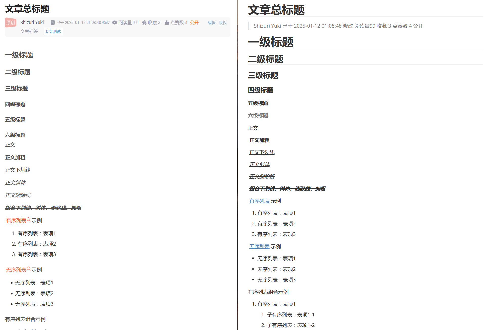

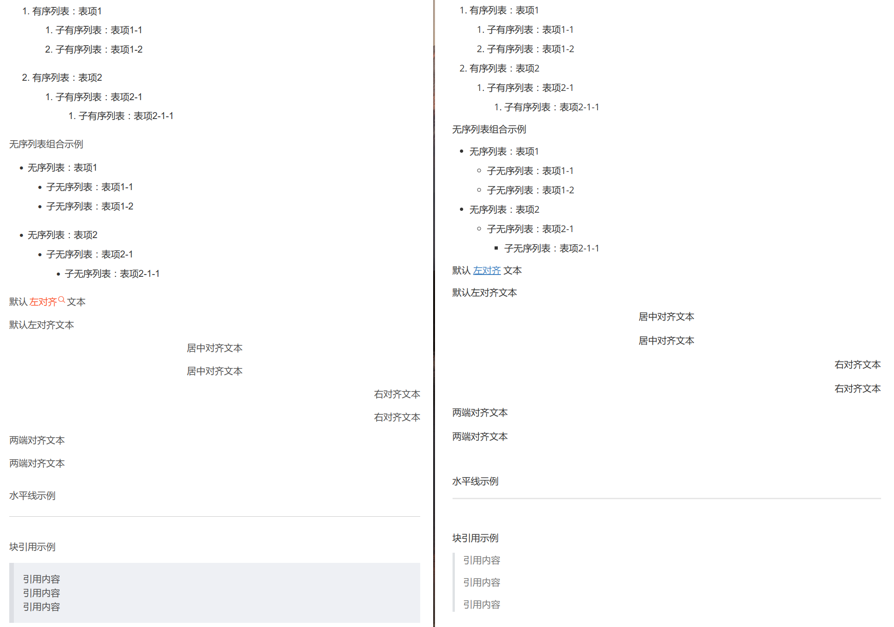

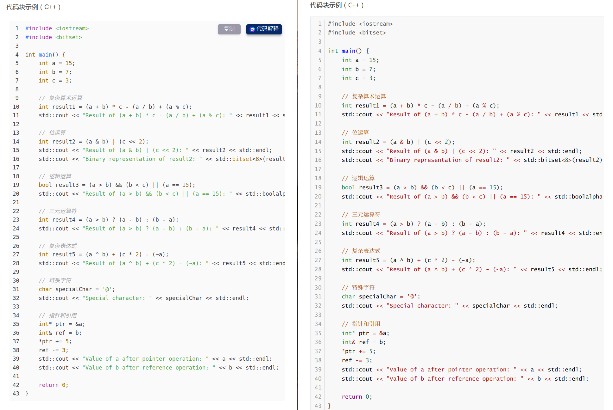

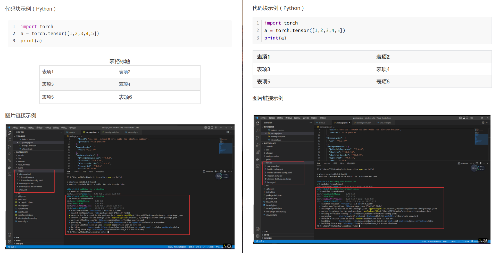


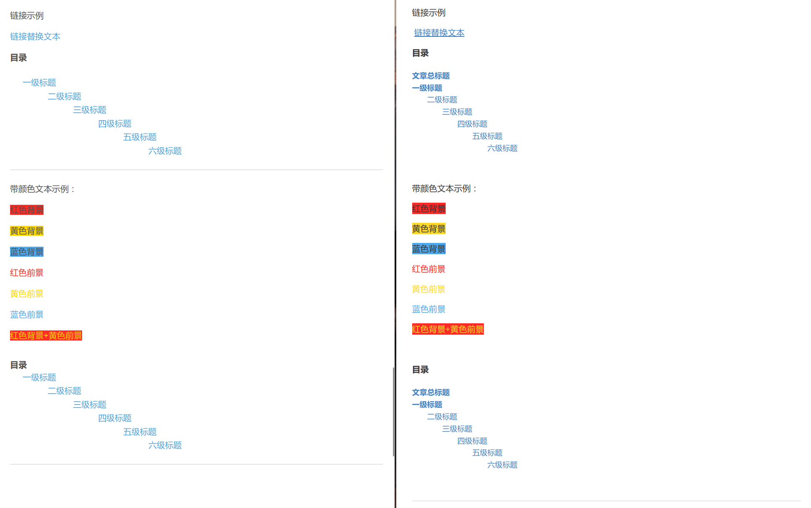

### CSDN Markdown 编辑器转换效果

左侧为 CSDN 网页，右侧为 typora 查看转换后的md，使用 typora 默认主题：

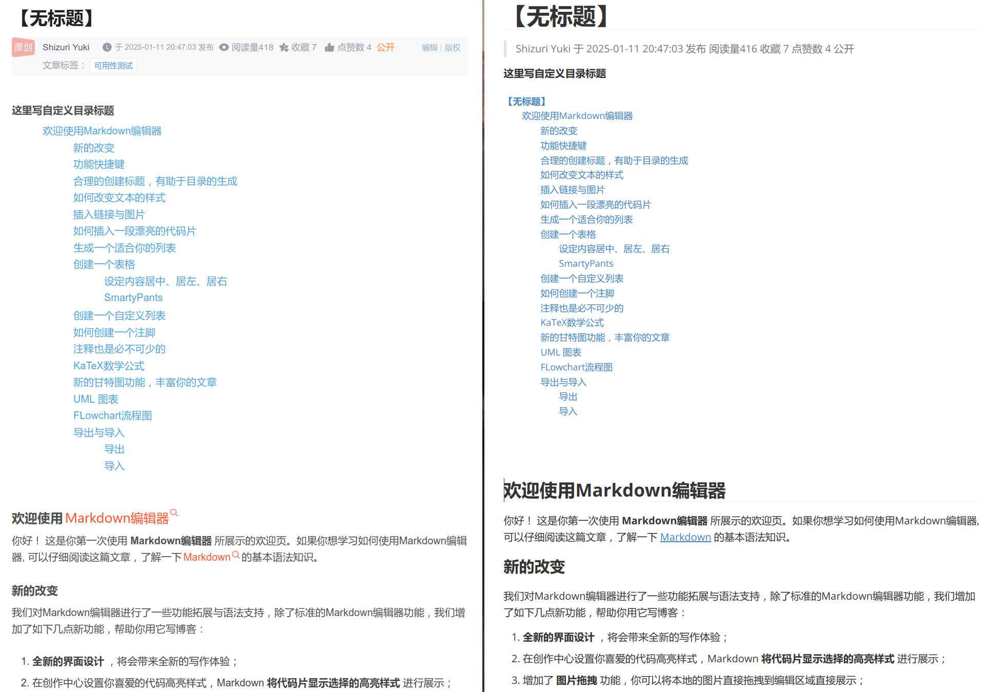

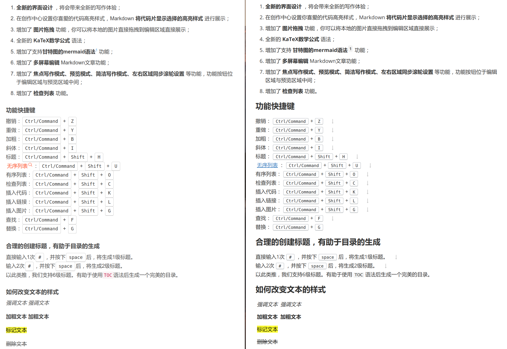

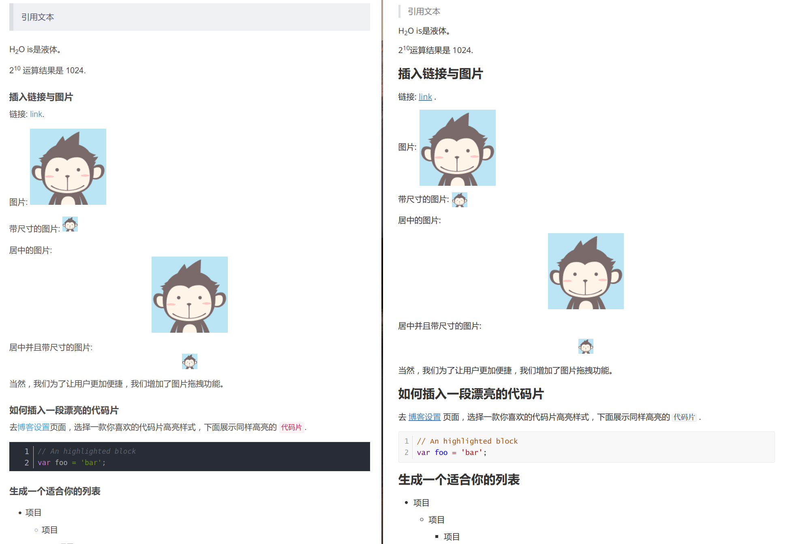

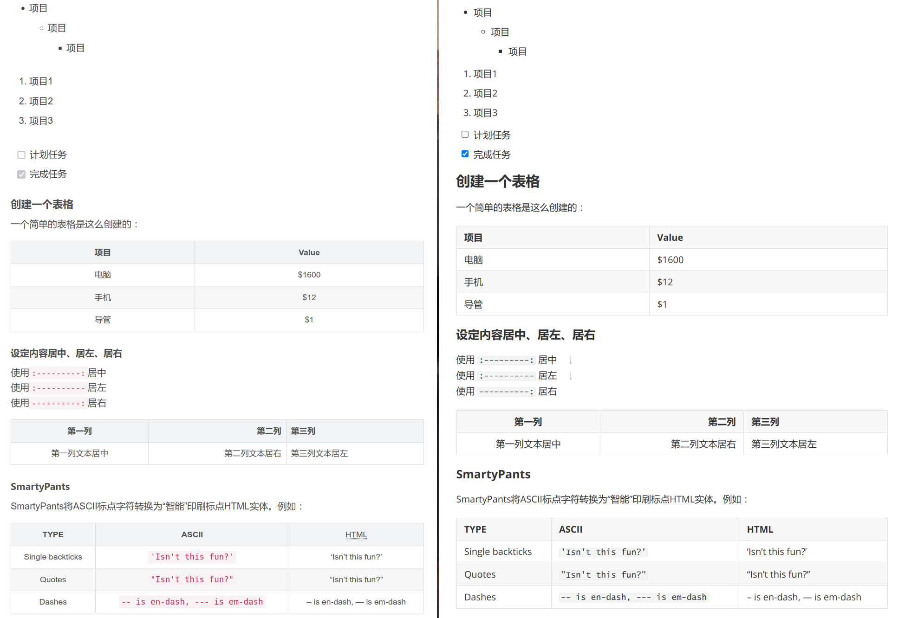


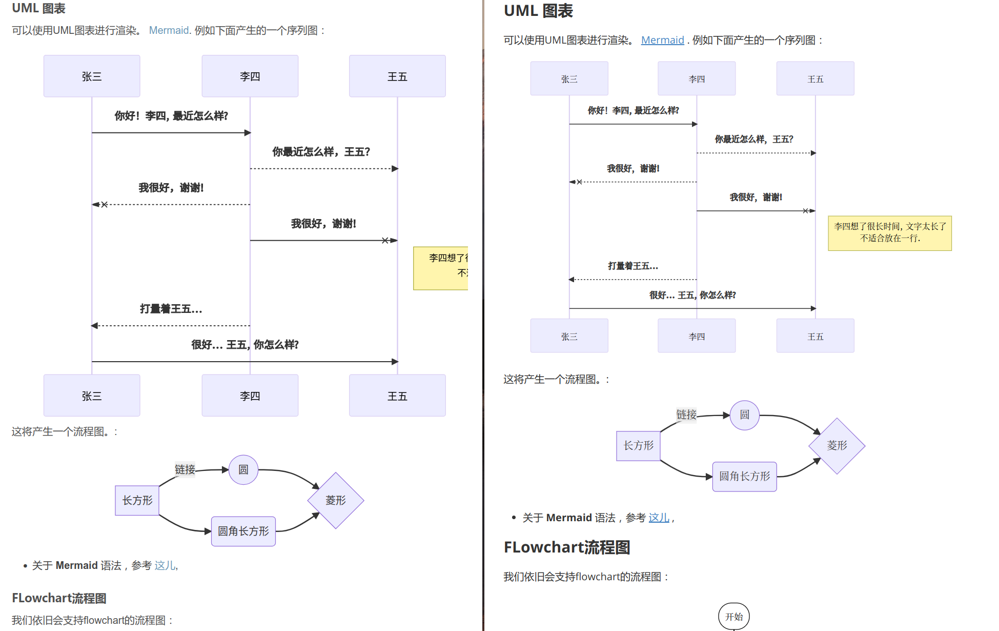

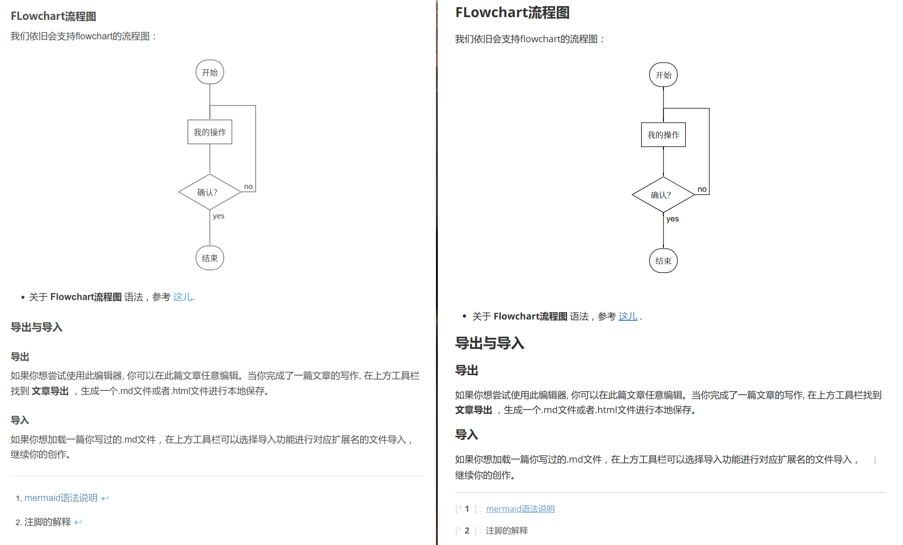

## 示例

`examples` 目录包含了 HTML 到 Markdown 的转换示例：

- `case1.html` 和 `case1.md`：示例 1 的 HTML 内容及其转换后的 Markdown 文件。
- `case2.html` 和 `case2.md`：示例 2 的 HTML 内容及其转换后的 Markdown 文件。

## 文件结构

```
csdn2md/
├── csdn2md_node.js           # Node.js 版本主脚本
├── csdn2md_tampermonkey.js   # 油猴脚本
├── examples                  # 示例文件目录
├── LICENSE                   # 项目许可证
└── README.md                 # 项目说明文件
```

## 许可证

本项目采用 [PolyForm Strict License 1.0.0](https://polyformproject.org/licenses/strict/1.0.0/) 许可证。**禁止商业用途，仅供学习和个人使用。**

## 使用限制

- **法律风险**：CSDN 实施了 `robots.txt` 爬虫协议，未经许可爬取其内容可能存在法律风险。请谨慎使用，避免用于商业用途。严禁爬取未授权的内容，***本仓库不提供大量爬取功能***，仅供学习参考和个人使用，不承担任何法律责任。
- **教育用途**：本仓库仅供学习和交流，不得用于任何商业目的。作者不承担因使用本工具而引发的任何法律责任。

## 贡献/问题反馈

如有任何建议或问题，欢迎提交 Issue ，作者会根据时间情况尽快回复。

**免责声明**：使用本工具前，请确保您拥有相关内容的合法使用权。作者对因使用本工具而导致的任何法律问题不承担责任。

