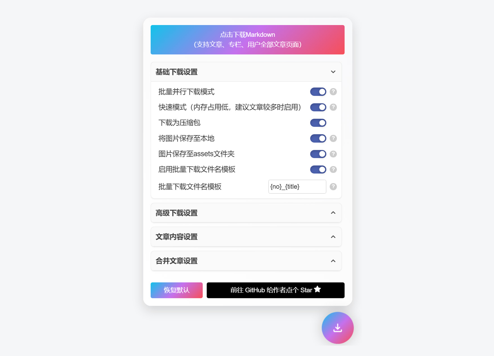
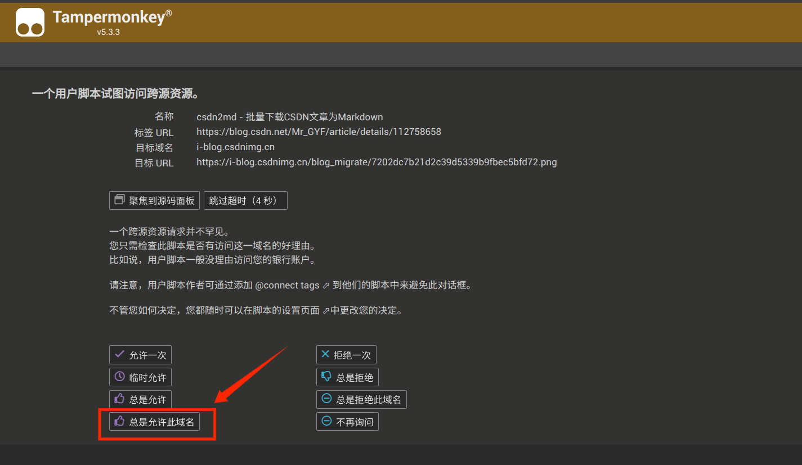
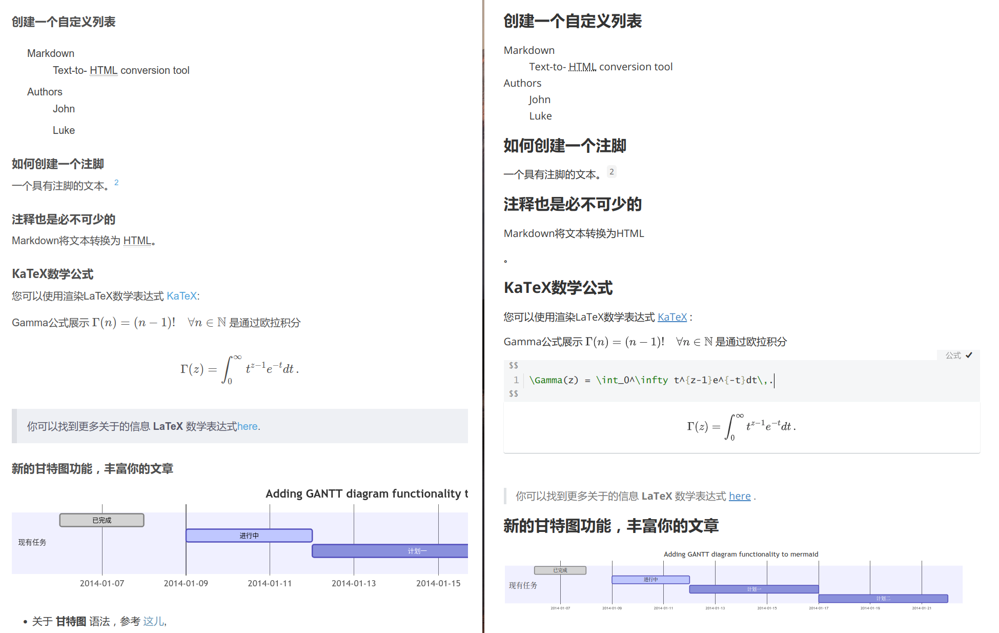

# csdn2md - 批量下载 CSDN 文章和专栏（支持油猴脚本）

## 简介

`csdn2md` 是一个用于***批量下载 CSDN 文章、专栏、用户全部文章并将其转换为 Markdown 文件***的工具。提供**油猴脚本**版本。

***安装油猴脚本 👉 [(greasyfork) csdn2md - 批量下载CSDN文章为Markdown](https://greasyfork.org/en/scripts/523540-csdn2md-%E6%89%B9%E9%87%8F%E4%B8%8B%E8%BD%BDcsdn%E6%96%87%E7%AB%A0%E4%B8%BAmarkdown)***

> [!WARNING]
>
> 本仓库最后测试时间为 `2025.12.6`
>
> 请注意 CSDN 页面结构随时可能变动，导致脚本无法正常使用。

> #### 为什么创建这个脚本？
>
> - **稳定更新**：现有的 CSDN 文章下载工具有不少失效或是年代久远。（即使有用，也无法完美处理 shi 山一样的 CSDN 前端页面）
> - **公式解析**：作者尝试了许多脚本，保存下来的公式是图片或乱码，非常不友好。（公式一定要能编辑！😤）
> - **完整支持**：希望能够完整地支持 CSDN 编辑器的全部产出内容。（强迫症患者的福音）
> - **批量下载**：希望能够一次性下载整个专栏的所有文章，而不是一个个手动下载。（节省时间）
> - **保存图片**：希望能够将文章中的图片也一并下载保存，而不是仅仅保存链接。（方便离线查看）
> - **支持合并文章**：一些专栏每篇文章都很短，希望能够将多篇文章合并为一篇长文章。（节省阅读时间）
> - **便于转为Hexo博客**：希望能够为下载的文章添加 Hexo 博客的 YAML 元信息，方便博客迁移。（Hexo 党）

------

## Q&A

### 1. 我下载了油猴脚本，但是没有看到下载按钮

可能是你的浏览器阻止了油猴插件，需要你打开扩展程序的开发人员模式，此时油猴插件会显示 “Please enable developer mode to allow userscript injection.”

可参考 [https://blog.csdn.net/m0_57703994/article/details/143798922](https://blog.csdn.net/m0_57703994/article/details/143798922) 的教程解决该问题。

### 2. 点击下载弹出【一个用户脚本试图访问一个跨域资源】的提示

这是因为脚本需要访问 CSDN 的页面，以获取文章内容。
请点击【总是允许此域名】，否则脚本无法正常工作。

> 如果你点错了或者超时没有选到，可以到 Tampermonkey，点击【管理面板】，在【已安装脚本】中双击【csdn2md - 批量下载CSDN文章为Markdown】，点击【设置】，查看【XHR 安全】的【用户域名黑名单】是否有东西，如果有，删除即可。
>
> 

## 完整功能介绍

- **批量下载**：支持下载单篇文章、专栏、用户全部文章。
  - **单篇文章**：点击下载按钮，下载当前页面的文章内容。
  - **专栏**：在专栏页点击下载按钮，下载该专栏下的所有文章。
  - **用户全部文章**：在用户主页点击下载按钮，下载该用户的所有文章。
- **高保真转换**：转换后的 Markdown 文件尽可能保留 CSDN 编辑器的原始格式和语法特性，包括但不限于：
  - **数学公式**：支持 KaTeX 内联公式和公式块。
  - **多媒体**：图片、Bilibili 视频控件。
  - **代码**：内联代码和代码块。
  - **列表**：有序列表、无序列表、任务列表、自定义列表。
  - **排版**：加粗、斜体、删除线、下划线、高亮、内容对齐（左、中、右）。
  - **其他**：目录、注脚、引用块、链接、快捷键（kbd）、表格、上下标、甘特图、UML 图、FlowChart 流程图等。
- **下载选项**：提供多种下载选项，用户可以根据需要选择：
  - **并行下载**：使用 iframe 实现批量下载，保证下载完整性。
  - **高速下载**：使用 fetch 实现批量下载，速度更快，但可能有代码块语言无法识别等问题。
  - **添加序号前缀**：批量下载时文件名加入 "No_" 格式的序号前缀。
  - **压缩包下载**：将所有文章打包成一个 zip 压缩包。使用 fflate 库实现高速压缩。
  - **添加文章元信息**：添加文章的 YAML 元信息（对于转 Hexo 博客比较有用）。
  - **添加文章标题**：在 Markdown 文件中添加文章标题（以一级标题形式）。
  - **添加文章信息到引用块**：在 Markdown 文件中添加文章信息到引用块中。
  - ...

## 安装与使用

1. **安装 Tampermonkey 插件**：
   - 前往 [Tampermonkey 官网](https://www.tampermonkey.net/) 根据浏览器类型安装 Tampermonkey 插件。

2. **安装 `csdn2md` 脚本**：
   - 访问 [Greasy Fork 上的 csdn2md 脚本页面](https://greasyfork.org/en/scripts/523540-csdn2md-%E6%89%B9%E9%87%8F%E4%B8%8B%E8%BD%BDcsdn%E6%96%87%E7%AB%A0%E4%B8%BAmarkdown) 安装 `csdn2md` 脚本。
   - 安装完成后，刷新并访问 CSDN 文章/专栏页时会在页面右下角出现下载按钮。

3. **使用脚本下载**：
   - 打开需要下载的 CSDN 文章或专栏页面，点击页面右下角的下载按钮即可将内容保存为 Markdown 文件。
   - 建议使用 [Typora](https://typora.io/) 打开下载的 Markdown 文件以获得最佳显示效果。

4. **注意事项**：
   - 由于 CSDN 前端页面可能会变动，脚本可能无法正确识别。请务必检查下载的 Markdown 文件是否符合预期。若有问题，请提交 Issue 反馈。

## 对比效果

CSDN 有两种编辑器，它们所产出的网页不太一样，而本项目完美支持两种编辑器产出的文章页，几乎一致。以下是转换效果对比。

### CSDN 富文本编辑器转换效果

左侧为 CSDN 网页，右侧为 typora 查看转换后的md，使用 typora 默认主题：

### CSDN Markdown 编辑器转换效果

左侧为 CSDN 网页，右侧为 typora 查看转换后的md，使用 typora 默认主题：

## 许可证

本项目采用 [PolyForm Strict License 1.0.0](https://polyformproject.org/licenses/strict/1.0.0/) 许可证。

**禁止商业用途，仅供学习和个人使用。**

## 免责声明

CSDN 实施了 `robots.txt` 爬虫协议，严禁未经授权爬取。使用本工具前，请确保您拥有相关内容的合法使用权。

本仓库仅供代码学习参考使用，不得用于任何商业目的，作者对于您的使用及其造成的后果不承担任何法律责任。

## 贡献/问题反馈

如有任何建议或问题，欢迎提交 Issue ，作者会根据时间情况尽快回复。

